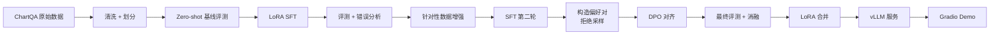

# posttrain-vlm

**可复现的视觉语言模型（VLM）领域后训练全流程 —— LoRA SFT、数据飞轮、DPO 偏好对齐，以 Qwen3-VL-4B + ChartQA 为例完整演示。**

## 项目简介

通用 VLM 的 zero-shot 能力已经很强，但针对特定领域做后训练，通常还能再涨一大截。本项目搭一条小而全、完全可复现的流程，把 `Qwen/Qwen3-VL-4B-Instruct` 适配到**图表问答**（ChartQA）任务，并在留出的测试集上对每个阶段做量化评测：

1. **LoRA SFT** —— 用领域指令数据做监督微调
2. **数据飞轮** —— 对 SFT 模型做错误分析 → 针对性补数据 → 第二轮 SFT
3. **DPO** —— 用拒绝采样从 SFT 模型构造偏好对，做 Direct Preference Optimization 对齐
4. **部署** —— LoRA 合并回基座，vLLM 起服务 + Gradio 简单 demo

## 流程图



## 结果

ChartQA 测试集上的 relaxed accuracy（5% 容差）。详细表格、消融实验和失败案例分析见 [`docs/results.md`](docs/results.md)。

| 阶段 | Relaxed Accuracy |
| --- | --- |
| Qwen3-VL-4B-Instruct（zero-shot） | 82.6% |
| + LoRA SFT | 83.75% |
| + 数据飞轮（SFT 第二轮） | TBD |
| + DPO | TBD |

> fast800 快速验证集、统一评测口径；数字随每轮实验完成而更新（明细见 [`docs/results.md`](docs/results.md)）。

## 目录结构

```
posttrain-vlm/
├── train.sh   # 一键训练（前台运行，实时输出 + logs/ 落盘）
├── test.sh    # 一键评测（默认评最新 adapter）
├── configs/   # 训练配置（LoRA SFT、DPO、merge）
├── data/      # 数据准备脚本与数据集注册
├── scripts/   # 入口脚本（run_train.py / run_test.py）与数据处理
├── serving/   # vLLM 启动脚本与 Gradio demo
└── docs/      # 实验记录与技术笔记
```

## 硬件与成本

所有实验都按**单张 24 GB 显卡**（RTX 4090 级）设计。每轮训练的 wall-clock 时间与成本记录在 [`docs/results.md`](docs/results.md)。

## 状态

开发中 —— 数据处理、训练配置、评测脚本和部署代码会逐步补全。

## 致谢

- [LLaMA-Factory](https://github.com/hiyouga/LLaMA-Factory) —— 统一微调框架（Apache-2.0）
- [Qwen3-VL](https://github.com/QwenLM/Qwen3-VL) —— 基座视觉语言模型（Apache-2.0）
- [ChartQA](https://github.com/vis-nlp/ChartQA) —— 图表问答基准（许可证见原仓库）

## License

Apache-2.0 —— 见 [LICENSE](LICENSE)。
