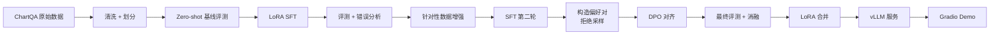
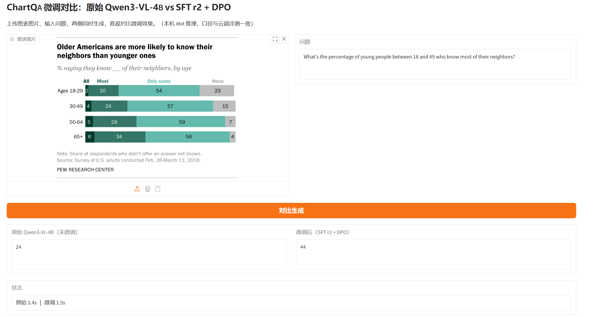

# posttrain-vlm

**可复现的视觉语言模型（VLM）领域后训练全流程 —— LoRA SFT、数据飞轮、DPO 偏好对齐，以 Qwen3-VL-4B + ChartQA 为例完整演示。**

## 项目简介

通用 VLM 的 zero-shot 能力已经很强，但针对特定领域做后训练，通常还能再涨一大截。本项目搭一条小而全、完全可复现的流程，把 `Qwen/Qwen3-VL-4B-Instruct` 适配到**图表问答**（ChartQA）任务，并在留出的测试集上对每个阶段做量化评测：

1. **LoRA SFT** —— 用领域指令数据做监督微调
2. **数据飞轮** —— 对 SFT 模型做错误分析 → 针对性补数据 → 第二轮 SFT
3. **DPO** —— 用拒绝采样从 SFT 模型构造偏好对，做 Direct Preference Optimization 对齐
4. **部署** —— LoRA 合并回基座，vLLM 起服务 + Gradio 简单 demo

## 流程图



## 结果

ChartQA 测试集上的 relaxed accuracy（5% 容差）。详细表格、消融实验和失败案例分析见 [`docs/results.md`](docs/results.md)。

| 阶段 | Relaxed Accuracy |
| --- | --- |
| Qwen3-VL-4B-Instruct（zero-shot） | 82.25% |
| + LoRA SFT | 83.63% |
| + 数据飞轮（SFT 第二轮） | 87.12%（fast800）/ 85.32%（全量） |
| + DPO | 87.25%（fast800）/ 85.84%（全量） |

> fast800 快速验证集、统一评测口径；数字随每轮实验完成而更新（明细见 [`docs/results.md`](docs/results.md)）。

## 目录结构

```
posttrain-vlm/
├── train.sh   # 一键训练（前台运行，实时输出 + logs/ 落盘）
├── test.sh    # 一键评测（默认评最新 adapter）
├── configs/   # 训练配置（LoRA SFT、DPO、merge）
├── data/      # 数据准备脚本与数据集注册
├── scripts/   # 入口脚本（run_train.py / run_test.py）与数据处理
├── serving/   # 本机 8bit 对比 demo（Gradio）+ 云 vLLM 服务脚本
└── docs/      # 实验记录与技术笔记
```

## 硬件与成本

所有实验都按**单张 24 GB 显卡**（RTX 4090 级）设计。每轮训练的 wall-clock 时间与成本记录在 [`docs/results.md`](docs/results.md)。

## 本地部署（量化对比 demo）



不依赖云 GPU：在 8 GB 显存的机器上以 **8bit** 加载 Qwen3-VL-4B（更接近 bf16 口径；`--load-4bit` 可切 NF4 省显存），并用 PEFT 的 `disable_adapter()` 在**同一模型实例**上关闭/开启微调增量——同一张图 + 同一问题，左右对比「原始模型 vs SFT r2 + DPO」的输出。

- 环境：conda env `ai`（Python 3.10 + torch 2.7.1+cu126）；依赖版本见 [`serving/requirements-local.txt`](serving/requirements-local.txt)
- 基座：`models/Qwen3-VL-4B-Instruct`（ModelScope 下载）；adapter：`models/dpo_adapter`
- 启动：双击 `serving/start_demo.bat`，或 `conda activate ai && python serving/local_app.py`
- 浏览器打开 `http://127.0.0.1:7860`；`python serving/local_app.py --smoke` 为命令行自检
- 推理口径与云端评测一致（同 instruction、视觉预算 768×768、左 padding、greedy）；8bit 下 6/6 测试题与云端 bf16 结果一致（见 [`results/local_demo_check.md`](results/local_demo_check.md)）
- 模型边界：这是 ChartQA 单值问答模型，解释/闲聊会被压成一个值；勾选界面上的「自由提问模式」可观察不加指令时的行为（基座会长篇解释、微调仍偏单值）

### 云端 vLLM 服务（已实测）

LoRA 与基座合并（`configs/merge_lora.yaml`，8.3G）后，用 vLLM 0.31 起 OpenAI 兼容服务（`serving/serve_vllm.sh`，mm 预算与评测同源）：

| 项 | 值 |
| --- | --- |
| 单请求 | 平均 0.10s，p50 0.11s（200 题，4090） |
| 并发 8 | **90 req/s**，p50 77ms |
| 显存 | 20.7G / 24G（util 0.85） |
| 正确性 | 合并前后 87.38% vs 87.25%（±1 题）；同批题目 vLLM 78.0% vs adapter 77.5% |

细节与踩坑见 [`results/vllm_serving.md`](results/vllm_serving.md)。

## 状态

开发中 —— 数据处理、训练配置、评测流水线已完成并归档；部署提供本机 4bit 对比 demo（云端 vLLM 为可选路径）。

## 致谢

- [LLaMA-Factory](https://github.com/hiyouga/LLaMA-Factory) —— 统一微调框架（Apache-2.0）
- [Qwen3-VL](https://github.com/QwenLM/Qwen3-VL) —— 基座视觉语言模型（Apache-2.0）
- [ChartQA](https://github.com/vis-nlp/ChartQA) —— 图表问答基准（许可证见原仓库）

## License

Apache-2.0 —— 见 [LICENSE](LICENSE)。
