# posttrain-vlm

**A reproducible domain post-training pipeline for Vision-Language Models — LoRA SFT, data flywheel, and DPO preference alignment, demonstrated on ChartQA with Qwen3-VL-4B.**

## Overview

General-purpose VLMs are strong zero-shot, but domain performance often improves substantially after targeted post-training. This project builds a small, fully reproducible pipeline that adapts `Qwen/Qwen3-VL-4B-Instruct` to **chart question answering** (ChartQA) and measures every stage on a held-out split:

1. **LoRA SFT** — supervised fine-tuning on domain instruction data
2. **Data flywheel** — error analysis on the SFT model, targeted data augmentation, second SFT round
3. **DPO** — preference pairs built by rejection sampling from the SFT model, aligned with Direct Preference Optimization
4. **Serving** — LoRA merged into the base model, served with vLLM behind a simple Gradio demo

## Pipeline

```mermaid
flowchart LR
  A[ChartQA raw data] --> B[Processing + splits]
  B --> C[Zero-shot baseline eval]
  C --> D[LoRA SFT]
  D --> E[Eval + error analysis]
  E --> F[Targeted data augmentation]
  F --> G[SFT round 2]
  G --> H[Preference pair construction<br/>rejection sampling]
  H --> I[DPO alignment]
  I --> J[Final eval + ablation]
  J --> K[LoRA merge]
  K --> L[vLLM serving]
  L --> M[Gradio demo]
```



## Results

Relaxed accuracy (5% tolerance) on the ChartQA test split. Detailed tables, ablation, and the failure-case analysis live in [`docs/results.md`](docs/results.md).

| Stage | Relaxed Accuracy |
| --- | --- |
| Qwen3-VL-4B-Instruct (zero-shot) | TBD |
| + LoRA SFT | TBD |
| + Data flywheel (SFT round 2) | TBD |
| + DPO | TBD |

> Training is in progress; numbers are filled in as runs complete.

## Repository layout

```
posttrain-vlm/
├── configs/   # Training configs (LoRA SFT, DPO, merge)
├── data/      # Dataset preparation scripts and registries
├── eval/      # Evaluation harness and metrics
├── scripts/   # End-to-end pipeline scripts
├── serving/   # vLLM launch script and Gradio demo
└── docs/      # Results log and technical notes
```

## Hardware & cost

All experiments are designed to run on a **single 24 GB GPU** (RTX 4090 class). Wall-clock time and cost per run are logged in [`docs/results.md`](docs/results.md).

## Status

Work in progress — data processing, training configs, evaluation harness, and serving code are being added step by step.

## Acknowledgements

- [LLaMA-Factory](https://github.com/hiyouga/LLaMA-Factory) — unified fine-tuning framework (Apache-2.0)
- [Qwen3-VL](https://github.com/QwenLM/Qwen3-VL) — base vision-language model (Apache-2.0)
- [ChartQA](https://github.com/vis-nlp/ChartQA) — chart question answering benchmark (see the original repository for licensing)

## License

Apache-2.0 — see [LICENSE](LICENSE).